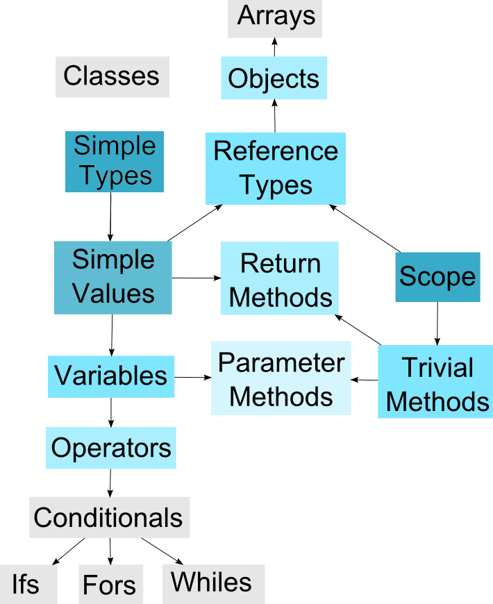

# Educational Books

## Content Summary

This eBook focused sub-section covers several types of written content:
- Books or papers that I have already written and/or published.
  - Academic papers will be published in their entirety.
  - Commercial books will only have samples.
- Summaries and road-maps relating to future projects.

#### [Crowd Simulation](CrowdSimulation-BScThesis/)

Compared and contrasted the applications of various existing crowd simulation techniques. Essentially a long literature review.

#### [Programming Metaphors](ProgrammingMetaphors-MScThesis/)

Exploration of how one might teach programming concepts by converting them into real-world metaphors. For example, variables as envelopes that can contain one piece of paper (i.e. their value for primitives, or an address for objects).

A key concept from this paper was the idea of a conceptual hierarchy. For a student to *truly* understand an idea, they could have to understand all the preceding concepts. Take the following diagram with a pinch of salt, it is for illustrative purposes only (for example, it excludes certain beginner concepts like expressions, and makes arrays and flow-of-control structures appear equally complex):

The reason such a hierarchy was a key idea is simple: by ensuring our metaphors accurately portrayed fundamental concepts (such as Scope and Types), students would be less likely to form a misconception later.

#### [Programming Yourself](Programming-Yourself/)

This work-in-progress suggests ideas for how programming can be used as a learning tool. For example, if you're studying physics try to program a Newtonian equation solver.

The reason this works is that, to program something, you have to *really* understand it. Therefore programming gives you a set of tools to test, explore, and grow your understanding until you get it just right.

## Future Works

I'm currently in the process of writing a paper on Genetically Trained Artificial Neural Networks. A quick summary of my findings so far: GTANNs are interesting, and have some niche applications, but tensor-based deep-learning architectures outperform them on every front (of those that I've tested).