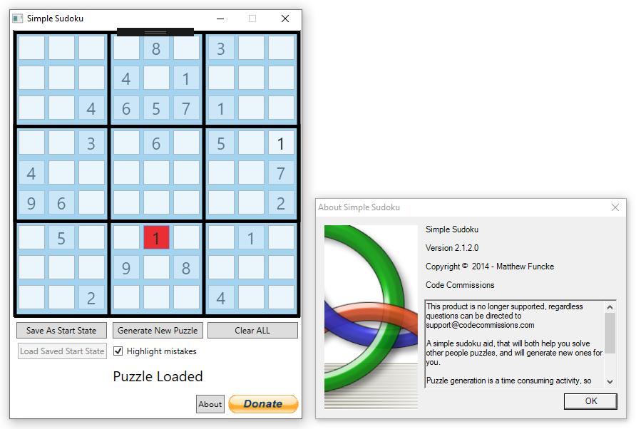

# Simple Sudoku

This was the first project I created with commercial intent. It is a simple Sudoku puzzle generator and solver:

I havn't shared the source code, not because it's proprietary, but because (upon reflection) it's truly horrific. In fact, I plan on using snippets as examples of bad-practices within a future Code Style course.

## Playable .exe

SudokuGame.zip contains an executable of the game that should run on any machine with the .Net Framework installed. At the time of upload, the .exe had been freshly compiled, and according to it's [Virus Total report](https://www.virustotal.com/gui/file/56378ac4973a91ce0c33b4566da64d34b41bb3a22e52020fbae3b96c789f13b9/detection) was cleared by all but 1 of their scanners - regardless, treat all binaries with caution.